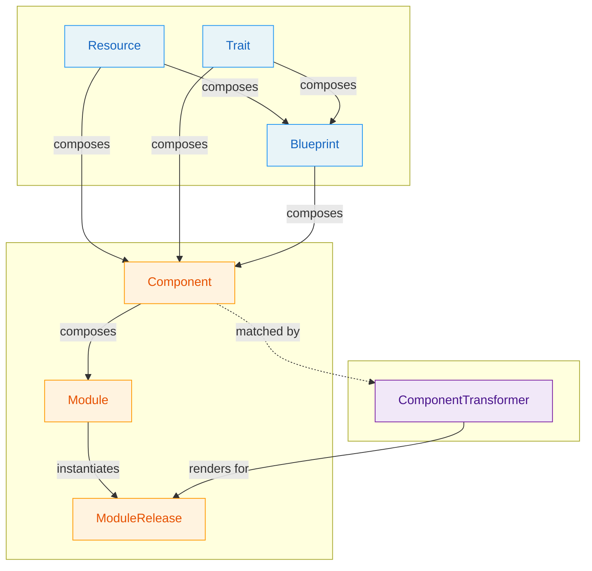

# OPM Definition Types

OPM organizes its types into three families: **Primitives**, **Constructs**, and **Adapters**.

**Primitives** are schema contracts — independently authored building blocks that define *what* exists, *how* it behaves, and *what reusable pattern* applies. They share the same shape (`metadata` + `spec`) and are composed into Constructs.

**Constructs** are framework types — they organize, compose, deploy, and verify the application model. They consume Primitives but don't define schemas for composition themselves.

**Adapters** are the translation layer between the application model and a target runtime. They describe what a target supports and how Components render into target-specific resources. Adapters consume Constructs and Primitives but live outside the composition hierarchy.

### Litmus Test

> **Does it define a reusable `spec` that gets composed?** → **Primitive**
>
> **Does it organize, compose, or deploy the model?** → **Construct**
>
> **Does it bridge the model to a target runtime?** → **Adapter**

## Summary

| Type | Family | Question It Answers | Level |
|------|--------|---------------------|-------|
| [**Resource**](primitives.md#resource) | Primitive | "What must exist?" | Component |
| [**Trait**](primitives.md#trait) | Primitive | "How does it behave?" | Component |
| [**Blueprint**](primitives.md#blueprint) | Primitive | "What is the reusable pattern?" | Component |
| [**Component**](constructs.md#component) | Construct | "What composes primitives?" | Module |
| [**Module**](constructs.md#module) | Construct | "What is the application?" | Top-level |
| [**ModuleRelease**](constructs.md#modulerelease) | Construct | "What is being deployed?" | Deployment |
| [**ComponentTransformer**](adapters.md#componenttransformer) | Adapter | "How does a component become a target resource?" | Runtime |
| [**Platform**](adapters.md#platform) *(planned)* | Adapter | "What target are we rendering to?" | Runtime |

## Decision Flowchart

1. **Does it define a reusable `spec` schema that gets composed?**
    - Yes → It's a **Primitive**:
        1. Is this a standalone deployable thing? → **Resource**
        2. Does this modify how a Resource operates? → **Trait**
        3. Is this a reusable composition of Resources/Traits? → **Blueprint**
    - No → continue.
2. **Does it organize, compose, or deploy the application model?**
    - Yes → It's a **Construct**. See [Constructs](constructs.md).
3. **Does it bridge the model to a target runtime?**
    - Yes → It's an **Adapter**. See [Adapters](adapters.md).
