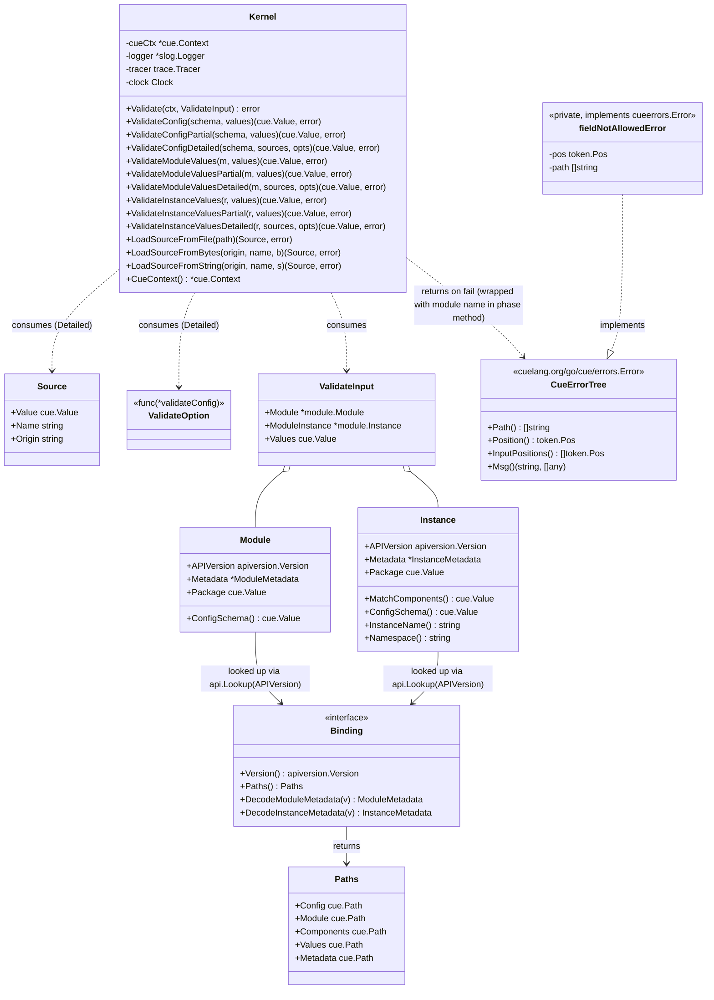
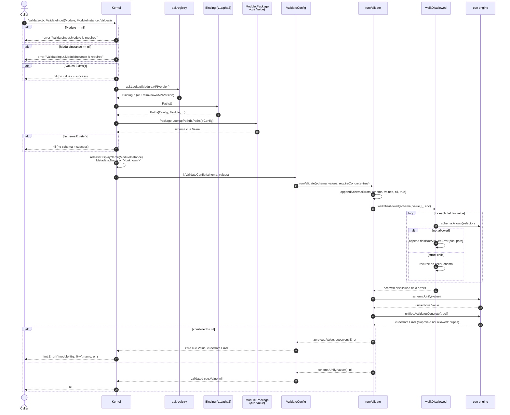

# Kernel.Validate Flow

Complete flow analysis of `Kernel.Validate` — the phase method that asserts user-supplied values against a module's `#config` schema. Validation only: no matching, no rendering, no metadata decoding.

The phase method delegates to one of three primitives that form the canonical validation surface:

- `Kernel.ValidateConfig` — concrete check on a single value
- `Kernel.ValidateConfigPartial` — same, without the concreteness requirement
- `Kernel.ValidateConfigDetailed` — unify-then-validate over an ordered slice of `Source`

All three return CUE-native errors (`cuelang.org/go/cue/errors.Error`-walkable). Frontends consume them via `cueerrors.Errors`, `cueerrors.Positions`, or `cueerrors.Print`. Presentation is outside the kernel's contract — the library ships no formatter; the frontend owns its display.

Source files:

- `opm/kernel/phases.go:23` — `Kernel.Validate` phase entry point
- `opm/kernel/validate.go` — `ValidateConfig`, `ValidateConfigPartial`, `ValidateConfigDetailed`, the internal `runValidate` + `walkDisallowed` + `fieldNotAllowedError`
- `opm/kernel/source.go` — `Source`, `ValidateOption`, `Partial()`
- `opm/kernel/source_loader.go` — `LoadSourceFromFile`, `LoadSourceFromBytes`, `LoadSourceFromString`
- `opm/kernel/validate_typed.go` — `ValidateModuleValues*` / `ValidateInstanceValues*` typed shortcuts
- `opm/kernel/inputs.go:11` — `ValidateInput`
- `opm/module/module.go`, `opm/module/release.go` — artifact types and `ConfigSchema()` accessors
- `opm/api/api.go`, `opm/api/registry.go` — version binding

## Class Diagram

Types involved in the call. `Module` and `Instance` carry the `cue.Value` `Package` as source of truth; `Metadata` is a decoded cache. The per-version `Binding` supplies the CUE paths the kernel reads. Errors flow as `cuelang.org/go/cue/errors.Error` — no library-defined wrapper type.



## Sequence Diagram

End-to-end call sequence for the phase method. Guard checks short-circuit early; the heavy lifting happens in `runValidate` → `walkDisallowed` + `cue.Unify` + `cue.Validate`. The phase method wraps the resulting CUE error tree with `module %q:` framing; `errors.As` and `cueerrors.Errors` both walk through the wrap.



## Step-by-Step

`Kernel.Validate` (`opm/kernel/phases.go:23`) is a thin orchestrator. Five phases:

### 1. Input guards

- `in.Module == nil` → `fmt.Errorf("ValidateInput.Module is required")`
- `in.ModuleInstance == nil` → `fmt.Errorf("ValidateInput.ModuleInstance is required")`
- `!in.Values.Exists()` (zero `cue.Value`) → `nil` (treated as "no values supplied" — success)

### 2. Resolve per-version binding

`api.Lookup(in.Module.APIVersion)` (`opm/api/registry.go:48`) returns a `Binding` from the process-wide registry. Bindings self-register from `init()` in `opm/api/v1alpha2/`. Lookup miss wraps `apiversion.ErrUnknownAPIVersion`.

### 3. Extract `#config` schema

`schema := in.Module.Package.LookupPath(b.Paths().Config)` — the binding's `Paths().Config` is the CUE path `"#config"`. If the schema does not exist on the module, validation is skipped (returns `nil`).

The same schema is reachable directly via `(*Module).ConfigSchema()` (the typed shortcuts use this accessor).

### 4. Compute display name

`releaseDisplayName(rel)` reads `rel.Metadata.Name`, falls back to `<unknown>`. Used only in the `module %q:` error wrap that follows.

### 5. Delegate to `ValidateConfig` and wrap on failure

```go
if _, vErr := k.ValidateConfig(schema, in.Values); vErr != nil {
    return fmt.Errorf("module %q: %w", name, vErr)
}
return nil
```

The phase method itself never produces a custom error type — the wrap is `fmt.Errorf` with `%w`. Callers reach the underlying CUE error tree via `errors.As` or `cueerrors.Errors`.

## Inside `ValidateConfig` / `runValidate` / `appendSchemaErrors`

`opm/kernel/validate.go`. Call chain: `ValidateConfig` (or `ValidateConfigPartial`) → `runValidate(schema, values, requireConcrete)` → `appendSchemaErrors(schema, value, acc, requireConcrete)`. `runValidate` short-circuits on a zero schema or zero values, then delegates to `appendSchemaErrors` which performs the two checks below and folds them into one error tree.

### 5a. `walkDisallowed` (inside `appendSchemaErrors`)

Recursive descent over the value tree (`opm/kernel/validate.go`). For each field:

- `schema.Allows(selector)` — if false, append `fieldNotAllowedError{pos, path}` to the accumulator.
- Otherwise, if the field is a struct, recurse with the corresponding child schema.

This catches "extra field" errors with precise source positions — CUE's own diagnostic for closed-schema rejections drops positions, hence the workaround. `fieldNotAllowedError` implements `cuelang.org/go/cue/errors.Error` so it walks alongside CUE-native errors transparently.

### 5b. CUE unification + (optional) concreteness (inside `appendSchemaErrors`)

```go
unified := schema.Unify(value)
unified.Validate(/* cue.Concrete(true) only when requireConcrete */)
```

Catches:

- Type mismatches
- Pattern/regex violations
- Disjunction failures
- Missing required fields (only when `Concrete(true)`)

`"field not allowed"` errors are filtered out here — already captured by the walker with better paths.

### 5c. Return shape (in `runValidate`)

`runValidate` consumes the accumulated tree from `appendSchemaErrors`. If any error accumulated, return `(zero cue.Value, combined cueerrors.Error)`. Otherwise return `(schema.Unify(values), nil)`. No library-defined wrapper struct: the error is the raw CUE tree.

## Single-source vs Layered

Two branches of the validation surface:

- **Single value** (`ValidateConfig`, `ValidateConfigPartial`, `ValidateModuleValues`, `ValidateInstanceValues` and their `Partial` counterparts) — caller supplies one pre-merged `cue.Value`. Used by `Kernel.Validate`, `Kernel.ProcessModuleInstance`, admission webhooks that see a single `values:` field on a CR.
- **Layered** (`ValidateConfigDetailed`, `ValidateModuleValuesDetailed`, `ValidateInstanceValuesDetailed`) — caller supplies an ordered `[]Source`; the kernel unifies in stack order then validates the merged value. Per-source attribution flows through `token.Pos.Filename`, populated from `cue.Filename(Origin)` at compile time.

The detailed branch is what frontends with multiple values sources reach for: CLI `-f a.cue -f b.cue`, operator `ConfigMap → Secret → CR overlay`, XR composition function input. The single-value branch is the primitive everything else builds on.

`Partial()` as an option to `ValidateConfigDetailed` skips the concrete check on the merged value — `walkDisallowed` and per-field constraint checks still run. Used by lint subcommands, IDE/LSP live feedback, admission paths that intentionally validate a draft.

## What `Validate` Does NOT Do

- Does not fill `values` into the release `Package` — that happens in `Kernel.ProcessModuleInstance` (`opm/kernel/process.go:29`).
- Does not decode release metadata — also `ProcessModuleInstance`.
- Does not match components against platform transformers — that is `Kernel.Match`.
- Does not produce rendered output — that is `Kernel.Compile` / `Kernel.Plan`.

`Validate` is the schema-conformance check only. `Compile` calls it internally before matching and rendering.
