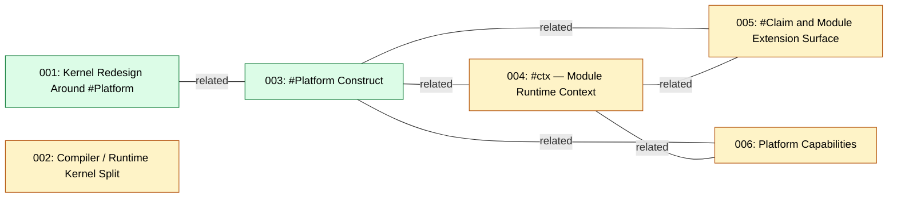
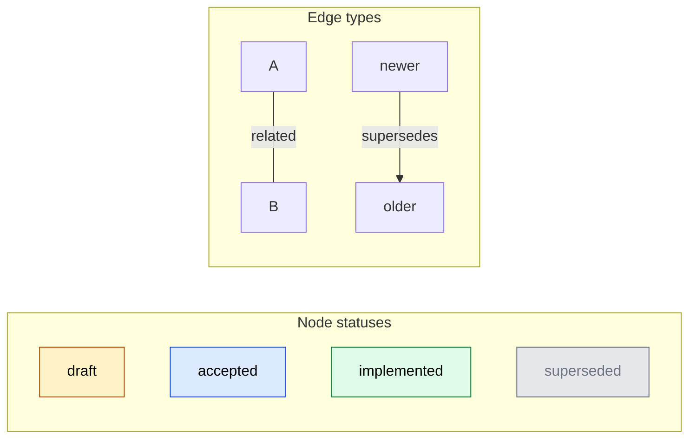

# Enhancement Relationship Graph

<!-- Generated by `task enhancements:graph` — do not edit by hand. -->

```mermaid
graph LR
  classDef draft       fill:#fef3c7,stroke:#b45309,color:#000
  classDef accepted    fill:#dbeafe,stroke:#1d4ed8,color:#000
  classDef implemented fill:#dcfce7,stroke:#15803d,color:#000
  classDef superseded  fill:#e5e7eb,stroke:#6b7280,color:#6b7280

  N001["001: Kernel Redesign Around #Platform"]:::implemented
  N002["002: Compiler / Runtime Kernel Split"]:::draft
  N003["003: #Platform Construct"]:::implemented
  N004["004: #ctx — Module Runtime Context"]:::draft
  N005["005: #Claim and Module Extension Surface"]:::draft
  N006["006: Platform Capabilities"]:::draft

  N001 ---|related| N003
  N003 ---|related| N004
  N003 ---|related| N005
  N003 ---|related| N006
  N004 ---|related| N005
  N004 ---|related| N006
```

## Legend

```mermaid
graph LR
  classDef draft       fill:#fef3c7,stroke:#b45309,color:#000
  classDef accepted    fill:#dbeafe,stroke:#1d4ed8,color:#000
  classDef implemented fill:#dcfce7,stroke:#15803d,color:#000
  classDef superseded  fill:#e5e7eb,stroke:#6b7280,color:#6b7280

  subgraph statuses ["Node statuses"]
    Ldraft["draft"]:::draft
    Laccepted["accepted"]:::accepted
    Limplemented["implemented"]:::implemented
    Lsuperseded["superseded"]:::superseded
  end

  subgraph edges ["Edge types"]
    Erel_a["A"] ---|related| Erel_b["B"]
    Esup_new["newer"] -->|supersedes| Esup_old["older"]
  end
```
